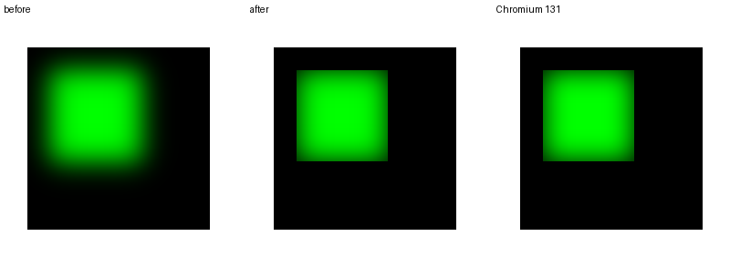
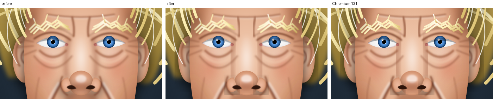

# Filter region and primitive subregion as the layer scissor (harness)

`_logos_full.rs` now scissors a filtered group the way a browser does:
the filter region bounds the source graphic (Blink 131
`FilterEffect::ApplyBounds` intersects every SVG effect, `SourceGraphic`
included, with `FilterRegion ∩ FilterPrimitiveSubregion`), and the last
primitive's subregion within the region bounds the result. Rects come from
usvg (`Filter::rect()`, `Primitive::rect()`, transformed by the group's
absolute transform); `NO_FILTER_REGION` restores the old behaviour.
Binaries: `_logos_full_master_h10` (before) / `_logos_full_master_h11`
(after) on master 1334764; `_logos_full_shadowcap` / `_logos_full_shadowcap2`
on #361.

## Ported blur reftests (batch 08), femtovg test vs Chromium 131, px > 8/255

| pair | before | after |
|---|---|---|
| blur-primitive-subregion-clipping | 9.57 % | 0.00 % |
| blur-axis-zero-directional | 5.67 % | 5.67 % (anisotropic sigma, #362) |
| the other five | 0.00 % | 0.00 % |

Every test still matches its own reference at 0.00 %
(`wpt-blur-reftests-region-2026-09-23.txt`).

## Corpus A/B on master (`filter-region-corpus-2026-09-23.txt`)

84 of 552 frames change (BuseyBench, Firefox, probes, resvg, shadow-edges,
WPT blend reftests at 1/2/4x). Against Chromium refs for all 84: mean
px > 8 4.27 % → 4.18 %, structural 1.124 % → 1.130 %; 19 better, 59 same,
6 worse. The large moves are groups whose blur used to spread past the
region: gemini-3-1-pro-preview-custom-tools 4x 12.68 % → 7.56 %
(structural 3.54 → 0.81), gemini-3-1-pro-preview 4x 8.39 → 7.01,
grok-4-5 4x 2.43 → 1.94. Four of the six worse rows are within 0.04 %.
The other two are shadow groups on master, where the layer capture stops
at the scissor (#342): beyond-right 2x 0.00 → 3.65 %,
filter-drop-shadow-overflow-clipped 1x 5.35 → 7.53 %.

## Shadow files on #361 (`filter-region-shadow-361-2026-09-23.txt`)

With the shadow reach of #361 the two regressions vanish and the WPT pair
improves: all six shadow-edges placements 0.00 % before and after;
filter-drop-shadow-overflow-clipped 0.84 % / 2.17 % / 0.00 % → 0.00 % at
1/2/4x; kimi-k3, gpt-5-2-pro and mask-nested-origin-reduction unchanged
(the region does not explain mask-nested-origin-reduction's 0.75 % at 2x).

## Notes

Bounding the source graphic (the inner scissor) versus bounding only the
result was measured separately on master: identical frame set, mean
px > 8 4.18 % vs 4.17 %, the four rows that differ by more than 0.05 %
(custom-tools 4x 7.56 vs 7.21, grok-4-5 4x 1.94 vs 1.83) slightly favour
the open source. Blink clips the source, so the harness does; the
residue is the region itself (usvg's object bounding box versus Blink's
reference box), not the semantics.

`reftest.py` now retries a Chromium screenshot that comes back a single
colour and stops after three; one run in this session returned a blank
page and scored every pair at 33 %.
