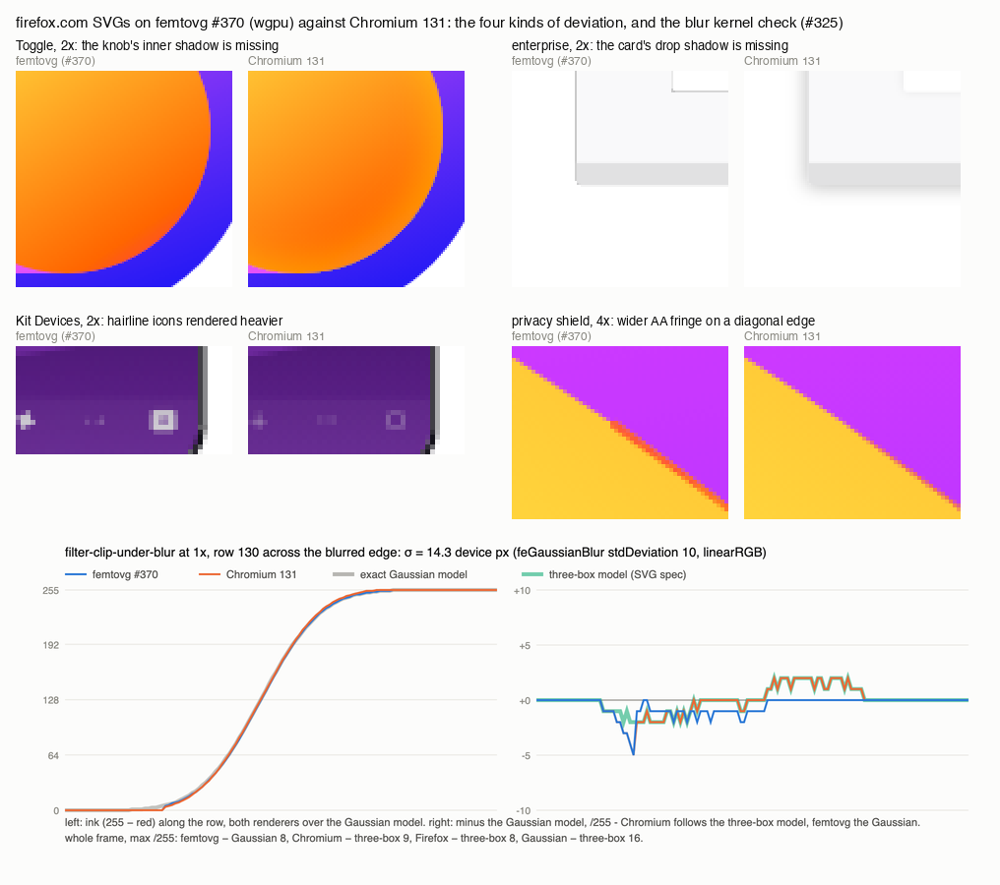

# firefox.com SVGs on #370, and what #325 / #362 / #337 would change (2026-10-02)

Thirty-four SVGs served by firefox.com and mozilla.org (`corpus/firefox-com/`; 15 distinct
drawings - the `width-N` variants are the same drawing at different intrinsic sizes, which the
harness scales away) rendered by the #370 branch (`wgpu-mipmaps`, dd414ad, WGPU backend, harness
with every cfg) at the four framings, against Chromium 131 and Firefox Developer Edition (Firefox at
all four framings for these files). The whole corpus - now 745 files, 2,980 frames - was re-measured
on the same build with corrected references (section 4). Per-frame numbers:
`firefox-com-check-2026-10-02.csv`; figure: `firefox-com-check.png` (repository root).

Measures: pixels beyond 20/255 against the browser ("px>20"), the same after a 2 px erosion
("structural"), the largest channel difference, and the Chromium-vs-Firefox envelope.
Attribution is by rewritten reference (`corpus_run/variants.py`): the SVG is rewritten to what
femtovg actually draws - a filter removed, an anisotropic blur made isotropic - Chromium renders
the rewrite, and femtovg's frame of the *original* is compared with it. What remains is what the
feature does not explain.

## 1. The new files

| design | files | features | worst framing | px>20 | structural | max | Firefox px>20 | Chromium vs Firefox |
|---|---:|---|---|---:|---:|---:|---:|---:|
| Bolt | 3 | linear gradients | 4x | 0.08 % | 0.000 % | 52 | 0.08 % | 0.00 % |
| btn-app-store | 1 | plain fills, badge text as paths | 1x | 0.32 % | 0.000 % | 224 | 0.32 % | 0.00 % |
| Cursor | 3 | linear gradients | 1x | 0.02 % | 0.000 % | 23 | 0.02 % | 0.00 % |
| devices-cropped | 3 | luminance masks, radial gradients (one of radius 0.07), gradient stroke | 1x | 0.17 % | 0.000 % | 59 | 0.17 % | 0.00 % |
| fingerprint-tracking | 3 | linear gradients | 1x | 0.17 % | 0.000 % | 77 | 0.23 % | 0.12 % |
| **firefox-enterprise-browser-img** | 1 | Sketch drop-shadow chains on `<use>`, luminance mask, evenodd | 4x | **3.76 %** | 0.385 % | 119 | 3.76 % | 0.01 % |
| Kit_Devices_Dark | 1 | nested clip paths, luminance mask of a stroke outline, elliptical radial gradient, group opacity | 2x | 0.59 % | 0.002 % | 214 | 0.41 % | 0.03 % |
| Kit_Devices_Light | 3 | as Dark | 4x | 0.48 % | 0.000 % | 152 | 0.48 % | 0.42 % |
| Kit_Keyhole_Dark_Mobile | 2 | clip path, radial gradients with `matrix()`, group opacity | 2x | 0.62 % | 0.000 % | 189 | 0.40 % | 0.22 % |
| Kit_Keyhole_Light | 3 | as Dark_Mobile | 2x | 0.14 % | 0.000 % | 160 | 0.14 % | 0.00 % |
| Kit_Keyhole_Light_Mobile | 1 | as Dark_Mobile | 2x | 0.33 % | 0.000 % | 170 | 0.32 % | 0.01 % |
| logo-word-hor-2026 | 1 | elliptical radial gradients, fill-opacity on a gradient | 1x | 0.23 % | 0.000 % | 136 | 0.24 % | 0.01 % |
| privacy-shield | 3 | linear gradients, stop-opacity | 4x | 0.45 % | 0.000 % | 190 | 0.44 % | 0.00 % |
| Shield | 3 | linear gradients | 1x | 0.16 % | 0.000 % | 46 | 0.16 % | 0.00 % |
| **Toggle** | 3 | Figma inner-shadow filter chain | 2x | **1.45 %** | 0.692 % | 89 | 1.43 % | 0.00 % |

Two drawings carry a filter chain the harness cannot map, and everything else is at the
anti-aliasing floor. Of the pixels beyond 20/255, at least 92 % lie within one pixel of an edge of
the Chromium reference for every design but those two (Toggle 16-73 %, enterprise 3-21 %: a shadow
is smooth, it is not on an edge); the structural share is 0.000 % for all of them at every framing
(Kit_Devices_Dark 0.002 % at 2x). Width variants with the same viewport aspect render identically;
the Kit variants differ among themselves only through their viewport (a 965- or 966-wide viewBox,
100x50 or 200x100), and femtovg and the browsers agree on each.

**Toggle: the Figma inner shadow (`filter0_i_*`).** The chain is `feFlood opacity 0 -> feBlend
in=SourceGraphic -> feColorMatrix in=SourceAlpha -> feOffset -16,-16 -> feGaussianBlur 21.65 ->
feComposite arithmetic k2=-1 k3=1 -> feColorMatrix (rgba 255,229,0 x 0.4) -> feBlend normal over the
shape`: a yellow glow along the knob's lower-right inner rim. `layer_chain` stops at the
`feColorMatrix in=SourceAlpha` (incomplete, so the group draws raw), and `shadow_chain` wants an
`feComposite operator="in"`. With the filter attribute removed from the reference, femtovg's frame
of the original matches Chromium's rewrite:

| framing | femtovg vs reference px>20 / structural | vs the rewrite px>20 / structural / max | the inner shadow's own weight (reference vs rewrite, px>20) |
|---|---:|---:|---:|
| 1x | 0.42 % / 0.068 % | 0.09 % / 0.000 % / 71 | 0.34 % |
| 2x | 1.45 % / 0.692 % | 0.11 % / 0.000 % / 47 | 1.27 % |
| 4x | 0.66 % / 0.114 % | 0.08 % / 0.000 % / 48 | 0.51 % |
| 1080p | 0.58 % / 0.460 % | 0.02 % / 0.000 % / 68 | 0.55 % |

The whole deviation is the inner shadow. Inner shadow = `color x SourceAlpha x (1 - blur(offset
SourceAlpha))`, which the Canvas API can already express: the group's silhouette drawn in the shadow
colour into a layer, the blurred offset silhouette drawn into that layer through a nested blur
layer composited `DestinationOut`, the layer composited over the group. That is a harness rule of
the same kind as the drop-shadow chain (rule 4), not a femtovg change; the femtovg-level alternative is a filter graph with `feOffset` and
arithmetic `feComposite` (#337's missing primitives). The idiom is Figma's standard export for every
inner shadow, so the rule pays beyond this file.

**firefox-enterprise-browser-img: Sketch drop shadows.** Ten `<use fill="#000" filter=...>` shadow
copies under the cards, each `feMorphology dilate 1 (SourceAlpha) -> feOffset 0,0 -> feGaussianBlur
7.5 (or 4) -> feColorMatrix alpha x 0.25 (or 0.07)` with no merge - the shadow alone, the card drawn
on top by a second `<use>`. `shadow_chain` recognises only the `feFlood + feComposite in` spelling,
so the copies draw raw: a black rounded rect under each light one, which shows as a hard dark
hairline where the browsers have a soft 25 % halo (figure, top right). Rewritten references:

| framing | femtovg vs reference px>20 / structural | all shadow filters removed: px>20 / structural | `feMorphology` removed only: reference vs rewrite px>20, max |
|---|---:|---:|---:|
| 1x | 1.40 % / 0.003 % | 0.42 % / 0.003 % | 0.00 %, 0 |
| 2x | 3.55 % / 0.000 % | 0.23 % / 0.000 % | 0.00 %, 7 |
| 4x | 3.76 % / 0.385 % | 0.50 % / 0.000 % | 0.00 %, 3 |
| 1080p | 1.47 % / 0.640 % | 0.01 % / 0.000 % | 0.00 %, 5 |

The shadows are the deviation; the `feMorphology` dilate of one user unit (0.3-1.7 px here) is
invisible at every framing, so the missing piece is the second spelling of the shadow-only chain
(morphology/offset/blur/colour-matrix on `SourceAlpha`, alpha scaled by the matrix instead of a
flood), which `shadow_chain` + `draw_shadow_only` can take as they are. What is left after the
shadows (0.2-0.5 % at 1x-4x, structural 0) is the glyph icons' hairlines (the NYT "T" stem, max 116
at 4x, identical at 1080p) - the thin-geometry case below.

**Everything else is edge coverage.** Three forms, all single-pixel, all on edges:
- hairlines drawn heavier than the browsers draw them: the phone's window-control icons in
  Kit_Devices (0.3 px wide at 2x; femtovg bright, Chromium faint), the "Download on the" text of the
  App Store badge at 1x (max 224), the NYT glyph's stem;
- a wider anti-aliasing fringe on long diagonal edges between complementary colours: privacy-shield's
  yellow check over purple reads as an orange line at 4x (max 190), Kit_Keyhole's dark shapes over
  pink;
- the viewport's clip edge at a fractional device coordinate (Kit_Keyhole_Light_Mobile, one column,
  max 40).
These are #358's subject (exact per-pixel coverage for antialiased fills; a draft, too slow as it
stands), not an open issue. Masks, nested clip paths, elliptical gradient transforms, the
radius-0.07 radial gradient, gradient strokes, `fill="none"` on the root and group opacity all
render as the browsers do: no structural difference anywhere.

## 2. #325 and #362, on these files and on the corpus

**#362 (anisotropic `stdDeviation`).** No firefox.com file has one. In the corpus three do, all in
`wpt-fill-blur-reftests/08-gaussian-blur-edge-and-kernel`: `blur-axis-zero-directional` and its
`-ref` (`"0 8"` and `"8 0"`), and `blur-negative-and-zero-stddev` (`"0 -5"`, a disabled filter).
With both values rewritten to the larger one - what the harness maps - Chromium's render of the
rewrite matches femtovg's frame of the original exactly:

| framing | femtovg vs reference px>20 / structural | vs the isotropic rewrite px>20 / max |
|---|---:|---:|
| 1x | 3.90 % / 2.906 % | 0.00 % / 3 |
| 2x | 10.70 % / 8.298 % | 0.00 % / 5 |
| 4x | 14.13 % / 12.943 % | 0.00 % / 4 |
| 1080p | 6.54 % / 6.213 % | 0.00 % / 5 |

So #362 accounts for all of that reftest and for nothing else in the corpus or in the new files.

**#325 (kernel shape, border sampling of image-sized targets).** The harness runs every blur in a
padded layer, so the border half of #325 is not exercised; the kernel half is. Across the corpus,
files with `feGaussianBlur`/`feDropShadow` (68) sit at the same px>20 median as the rest and at
0.000 % structural; the blur-specific residual appears only in the 8-25/255 band:

| set | framing | n | px>8 median / p90 | px>20 median / p90 | structural median | envelope px>8 / px>20 |
|---|---|---:|---:|---:|---:|---:|
| with feGaussianBlur/feDropShadow | 1x | 68 | 0.53 / 3.72 | 0.11 / 1.05 | 0.000 | 0.02 / 0.00 |
| with | 2x | 68 | 0.98 / 6.26 | 0.11 / 2.75 | 0.000 | |
| with | 4x | 68 | 0.92 / 9.52 | 0.11 / 3.66 | 0.000 | |
| with | 1080p | 68 | 0.35 / 14.38 | 0.11 / 11.15 | 0.000 | |
| without | 1x | 643 | 0.37 / 1.44 | 0.11 / 0.70 | 0.000 | 0.01 / 0.00 |
| without | 2x | 643 | 0.51 / 2.25 | 0.15 / 1.16 | 0.000 | |
| without | 4x | 643 | 0.31 / 1.75 | 0.05 / 0.78 | 0.000 | |
| without | 1080p | 643 | 0.11 / 0.47 | 0.04 / 0.21 | 0.000 | |

With two reftests whose chains the harness does not map (`filter-chain-offset-blur-feblend`,
`filter-chain-blur-feblend-sourcealpha`: an `feOffset` chain, 21.4 % each) and the #362 pair set
aside, the blur set's px>20 p90 at 1x and 2x is the rest's (0.65 % and 1.35 % against 0.70 % and
1.16 %). At 4x and 1080p it is not a kernel matter either: it is the filter work budget, below.

What the band is: `wpt-blend-reftests/filter-clip-under-blur` (a clipped group under
`stdDeviation="10"`, 14.3 device px at 1x, linearRGB) is the corpus file with the largest px>8
excess over the envelope (3.72 % vs 0.78 %) that is not an unmapped chain. Chromium's unfiltered
render, screenshotted with a transparent background, blurred offline in linearRGB with an exact
Gaussian and with the SVG specification's three-box approximation (d = 27), each composited over
white and compared with the real frames:

| | px>8 | px>20 | max |
|---|---:|---:|---:|
| Chromium filtered vs the three-box model | 0.03 % | 0.00 % | 9 |
| Firefox filtered vs the three-box model | 0.00 % | 0.00 % | 8 |
| femtovg vs the Gaussian model | 0.00 % | 0.00 % | 8 |
| Gaussian model vs three-box model | 1.16 % | 0.00 % | 16 |
| femtovg vs Chromium | 1.35 % | 0.09 % | 25 |

femtovg's blur is the Gaussian to 8/255 and the browsers' is the three-box to 9/255, on real
geometry with the quadrature passes of #340 and the clip; the residual between them is the kernel
gap the issue's status section measured on a synthetic source (there 7-8/255 at sigma 3-6, here up
to 16 at sigma 14, 25 once the clip edge and 8-bit rounding add), and it never crosses the
structural threshold. The BuseyBench portraits show the same band (px>8 excess over the envelope
0.9-2.1 points for gpt-5-6-terra-pro, gemini-3-7-flash, gpt-5-2-pro and
gemini-3-1-pro-preview-custom-tools at 1x; px>20 0.65-1.26 %, structural 0.000-0.053 %).

**Large sigmas: the filter work budget, not the kernel.** Twelve corpus frames lose their blur
outright. `Canvas` charges a blur `passes x taps x store pixels` samples against a 4 Gi-sample
budget (`DEFAULT_FILTER_WORK_BUDGET`, `set_filter_work_budget`); a layer whose filter does not fit
keeps its content and drops the filter, `begin_layer` still returns true, and no `LAYER_STATS`
counter changes. At 1080p a `stdDeviation="10"` on a 140-unit viewBox is 77 device px: 93 quadrature
passes of 94 taps over a 1.7 Mpx store, 15 G samples, so the four blur reftests
`filter-clip-under-blur`, `blur-edge-mode-transparent-fade`, `blur-primitive-subregion-clipping` and
`blur-element-expansion-vs-child-clip` (with their `-ref` twins) render sharp at 1080p: 6.9-37.7 %
px>20 with structural 6.6-37.1 %, after 0.00-0.09 % at the other framings. The harness now takes
`FILTER_WORK_GSAMPLES`; at 64 Gi samples those eight frames and `probes/bigblur` at 4x go to
0.00 % px>20 (max 3-22), `google-workspace-48px` at 1080p from 3.81 % to 0.02 %, a BuseyBench 1080p
frame from 0.99 % to 0.48 %; `bigblur` at 1080p stays at 17.5 % because its sigma passes
`MAX_CHAIN_BLUR_SIGMA` (128) and is clamped, the documented ceiling. The budget is a deliberate
cost guard, but the degradation is a cliff where the browsers downscale: `lib.rs` assigns that
large-sigma path to #325, whose text does not yet mention it. No new file is near it (Toggle's
sigma at 1080p is 23 px, nine passes; the enterprise shadows 13 px).

**Which new files #325 and #362 would improve: none today.** The only blurs among them are
Toggle's inner shadow (sigma 21.65 user units: 4.3 px at 1x, 23 px at 1080p) and enterprise's
shadows (sigma 7.5 and 4: 2.4 and 1.3 px at 1x), and both chains are unmapped, so no kernel runs.
Once they are mapped, their residual against the browsers will be this same sub-threshold band, and
closing it would mean rendering the three-box approximation rather than a Gaussian, which #325's
status already declines to propose. The border half of #325 would matter only to a consumer that
blurs an image-sized target through `filter_image` / `filter_image_chain`, which none of these files
does.

## 3. What is missing, and which files need it

| missing piece | kind | files that need it | what it is worth |
|---|---|---|---|
| Figma inner-shadow chain (`feOffset` + arithmetic `feComposite` + `feBlend normal` consuming `SourceGraphic`) | #337 subset (feOffset, feComposite operators); or a harness rule on existing Canvas primitives | Toggle (3 files) | 0.42-1.45 % px>20, 0.07-0.69 % structural -> about 0.1 % / 0.000 % |
| shadow-only chain in Sketch's spelling (`feMorphology` / `feOffset` / `feGaussianBlur` / `feColorMatrix` on `SourceAlpha`, no merge) | harness `shadow_chain` extension; `feMorphology` itself is a #337-type primitive the files do not visibly need | firefox-enterprise-browser-img | 1.40-3.76 % -> 0.01-0.50 % px>20; structural 0.64 % -> 0.000 % |
| exact per-pixel coverage for hairlines and diagonal edges | #358 (draft PR), not an open issue | Kit (10 files), btn-app-store, privacy-shield (3), the enterprise glyphs | the remaining 0.1-0.6 % px>20 of those files; structural already 0 |
| anisotropic blur (#362) | femtovg filter API | no new file; `blur-axis-zero-directional` in the corpus | 3.9-14.1 % px>20 of that reftest |
| kernel shape (#325) | would be the three-box approximation | no new file now; Toggle and enterprise after their chains are mapped | 8-25/255, below the corpus threshold |
| a blur over the filter work budget degrades to no blur at all | the large-sigma (downscaled) path `lib.rs` assigns to #325; not in #325's text, no counter reports it | no new file; 12 corpus frames (four blur reftests and `google-workspace-48px` at 1080p, `bigblur` at 4x) | 3.8-37.7 % px>20 -> 0.00-0.02 % |

## 4. Harness corrections made for this check

- `make_ref.py` sized the viewBox into the box; usvg sizes the SVG's own viewport (its
  width/height, with the viewBox letterboxed inside by preserveAspectRatio). For a file whose
  viewport aspect differs from its viewBox the browser reference was misplaced by up to 20 px. 24
  SVGenius icons (`width="200" height="200"` on 1280x1024-class viewBoxes), `ember.svg` and
  `fox-with-box-on-cloud.svg` (height only: usvg derives the width from the viewBox aspect) were
  affected; eight of the new Kit files would have been. The page now sizes the nested svg to the
  viewport exactly as usvg does, and `_logos_full.rs` clips `VIEWPORT_CLIP` to that viewport rather
  than to the square box. For the 24 + 1 files, px>20 median before / after: 1x 5.78 % / 0.16 %,
  2x 13.81 % / 0.20 %, 4x 16.41 % / 0.10 %, 1080p 9.62 % / 0.05 %; structural median 0.7-12.3 % ->
  0.000 %. SVGenius as a group: 1x median 0.22 % -> 0.19 %, p90 0.81 % -> 0.51 %, frames over 1 %
  px>20 23 -> 4 (1080p: 20 -> 0). Files whose viewport matches their viewBox are pixel-identical
  under the new page (checked on three square files at three framings each), so the rest of the
  2026-10-02 corpus numbers stand.
- `kit.svg` and `firefox/firefox-motion-head-pop-up-no-bg.svg` are SMIL animations whose first
  frame is empty; femtovg, Chromium and Firefox all render them blank now. Their earlier 9-12 % was
  Chromium's screenshot catching a later animation frame, not a renderer difference.
- `corpus_run/accuracy.py`: one build against both browsers at thresholds 8 and 20 per frame, with
  the envelope, resumable; `refs.py` takes `framings=` and `group=`; `_logos_full.rs` takes
  `FILTER_WORK_GSAMPLES` (the filter work budget in Gi samples, library default 4).

## 5. The corpus on #370, corrected references (px>20 vs Chromium)

| framing | frames | median | p90 | structural median | frames at 0.000 % structural |
|---|---:|---:|---:|---:|---:|
| 1x | 745 | 0.12 % | 0.75 % | 0.000 % | 676 |
| 2x | 745 | 0.15 % | 1.36 % | 0.000 % | 677 |
| 4x | 745 | 0.06 % | 0.88 % | 0.000 % | 688 |
| 1080p | 745 | 0.04 % | 0.58 % | 0.000 % | 660 |

The frames over 1 % structural are the known cases: `wpt` (30 files: masks and clip paths outside
the harness's rules), the two `feOffset` reftests, `blend-plus-lighter-isolated`, the
rotated/skewed subregion probes, `winding-overflow`, `lists-empty-state-comet`, the #362 pair, the
twelve budget-dropped blurs above, eight BuseyBench portraits at 2x-1080p (transient-budget
pass-throughs and the blur band), and now Toggle and the enterprise mock-up.
