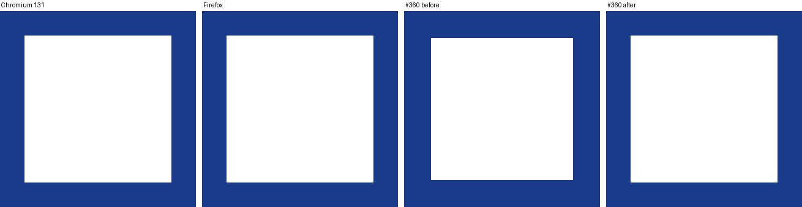
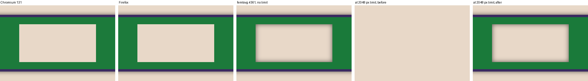
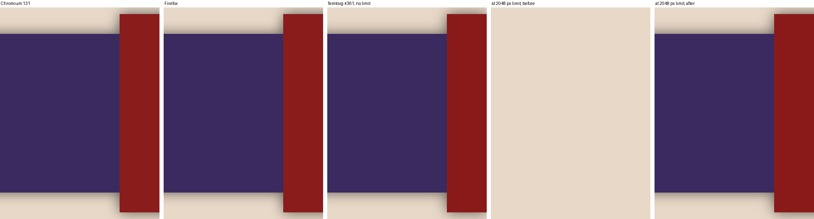

# Pressure probes: a degenerate strip beside a hole (#360) and a shadowed layer at the texture limit (#361)

Probes in `corpus/pressure/`, crops by `harness/sheet.py`. Chromium 131 and
Firefox Developer Edition agree on both scenes to the pixel.

## #360: a strip within the collinearity band next to a hole

`hole-strip-{nonzero,evenodd}.svg`: a square with a hole and a 0.001-unit
strip along the hole's first edge; `hole-*.svg` are the controls without
it. The hole classification samples the other contours' winding at the
midpoint of each contour's first edge, and the strip winds once around
that point, so the hole was classified solid and its fringe extruded
inward: a pixel smaller all round.

| render | strip vs control, px > 1/255 | strip vs Chromium, px > 8/255 |
|---|---|---|
| Chromium 131 | 0.00 % | - |
| Firefox | 0.00 % | 0.00 % |
| #360 before (`_logos_full_zeroarea2`) | 0.20 % (max delta 229), both rules | 0.20 % |
| #360 after (`_logos_full_zeroarea3`) | 0.00 % | 0.00 % (max delta 0) |

The control renders identically before and after. Fix: the contour is
classified once when the cache is built and gets an empty box in the
classification (no branch added to the pair walk). Corpus A/B (the
previous #360 commit against the fix, both with this harness, 471 frames
at 1/2/4x): only the four strip probes change; at 4x the strip is 0.004 px
wide, outside the 1/256 px band, and renders as a sliver either way.

## #361: a shadowed layer whose reach passes the texture limit

`wide-masked-shadow.svg` at `FRAME_W=2048 FRAME_H=256 BOX=2048 BOX_X=0
BOX_Y=0`: a 2048 px masked group under a sigma 8 drop shadow with a
caster crossing the right edge. The harness takes `MAX_TEXTURE_SIZE` to
lower the wgpu device's 2D texture limit (a VideoCore IV reports 2048).

| render | px > 8/255 vs Chromium |
|---|---|
| Firefox | 0.00 % |
| #361 before, unlimited (`_logos_full_shadowcap3`) | 1.69 % |
| #361 before, limit 2048 | 78.56 % (the masked group is discarded) |
| #361 after, unlimited (`_logos_full_shadowcap4`) | 1.69 % (bit-identical to before) |
| #361 after, limit 2048 | 1.69 %; 0.11 % from the unlimited frame (the off-screen caster's lost reach) |

The 1.69 % residue is the harness: femtovg casts the layer's shadow from
the masked result, so the mask window carries a halo, where SVG masks the
filtered result. The reach now takes only the room the limit leaves and a
reach the transient budget refuses falls back to the visible capture.
Corpus A/B (#361 before the change against after, `_logos_full_shadowcap3`
vs `_logos_full_shadowcap5`, 426 frames at 1/2/4x): 28 frames differ,
none at 1x - every one a layer whose store origin used to be fractional
because the unrounded canvas clamps applied when the viewport scissor
reached past the canvas; against Chromium a wash (px > 8 mean 3.33 % →
3.37 %, structural 0.130 % both).

Found on the way: SVG group opacity over `feDropShadow` hides the shadow
under opaque content before the opacity applies, while femtovg's layer
shadow follows Canvas 2D and shows through a translucent layer
(`wide-shadow.svg` in `~/src/femtovg-wt/blend/pressure`, a uniform
35/255 over the group); a harness mapping gap, not a library bug. And a
1920x1080 layer under a 60 px shadow blur exceeds the default filter-work
budget (4.74 G samples of 4 G) and drops its shadow silently; noted on #351.
