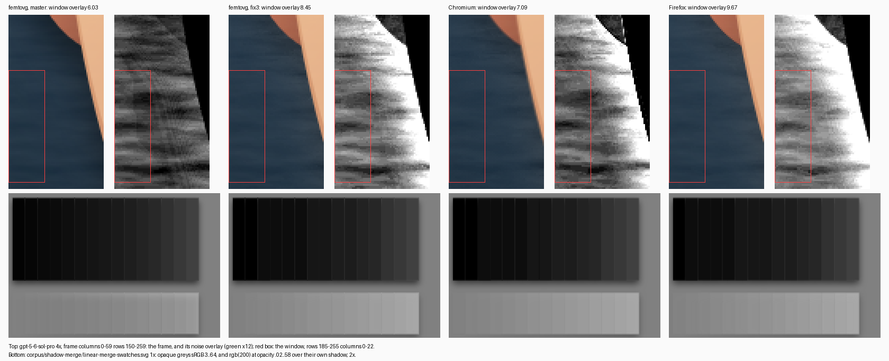

# A group shadow merges in linearRGB (rule 4, harness)

gpt-5-6-sol-pro at the 4x framing (`FRAME_W=460 FRAME_H=260 BOX=200 BOX_X=130 BOX_Y=30`,
`SKIP_UNSUPPORTED_FILTERS=1 VIEWPORT_CLIP=1 TRANSIENT_BUDGET_MB=1024`): beside the face, where the
`skinTexture` filter region reaches past the face path and its result is the noise alone, femtovg's
noise came out about a fifth weaker than Chromium's. Window: rows 185-255, columns 0-22, green. Overlay:
a frame minus the frame of the same file with the face's `filter` attribute removed (the harness's
`NO_TURBULENCE=1` renders that file bit-identically). Measured on Linux here: femtovg on lavapipe,
Chromium 141 headless shell (`--disable-gpu`) and Firefox 157.0; on the Mac, Chromium 131 gave 7.5
against femtovg's 6.1.

The cause is not the noise. The face sits in `<g filter="url(#shadow)">`, a written-out drop shadow
whose `feMerge` puts the group back over its shadow, and the filter has no
`color-interpolation-filters`, so every primitive runs in linearRGB, the merge included. Both browsers
convert the group to linearRGB, composite it over the shadow there and convert the result back.
The harness drew rule 4 as the shadow state around the group's layer, which composites the
two in sRGB. The two agree wherever the content is opaque or absent. Where semi-transparent
content lies over the shadow, the linear composite comes out brighter. The noise beside the face
is exactly that: alpha 0.05 over the shadow of the face, the ear and its own alpha.

## Isolation (`shadow_merge/run.py all`)

Overlay in the window. "master" is the harness before this change, "fix" after it, both on master
9d574e0; the reference column applies the spec arithmetic (`shadow_merge/feturbulence_ref.c`, the
spec's C code) to the noise alone over the frame without it, with no shadow, so it fits only the rows
without the shadow group.

| variant | master | fix | Chromium | Firefox | reference |
|---|---|---|---|---|---|
| full file | 6.03 | 8.45 | 7.09 | 9.67 | 7.19 |
| full file, shadow filter removed | 7.22 | 7.22 | 6.95 | 7.48 | 7.18 |
| full file, shadow filter `color-interpolation-filters="sRGB"` | 6.03 | 5.94 | 5.18 | 6.47 | |
| face path and its filter alone | 7.43 | 7.43 | 7.21 | 7.66 | 7.47 |
| the face alone in the shadow group | 6.55 | 8.72 | 8.25 | 9.90 | |
| the same, shadow filter in sRGB | 6.55 | 6.26 | 5.77 | 6.79 | |

Without the group, all three renderers land within 5 % of the reference arithmetic. That rules out the
library, the noise rect, its transform and the blend rect; the library's controlled chain test had
already said so. Inside the group, femtovg's overlay fell and both browsers' rose. Forcing the shadow
filter to sRGB drops both browsers by 27 to 33 %, and femtovg's old figure then sits between them.

**Per-pixel model** (`shadow_merge/model.py`). Each renderer gets its own inputs: the noise's alpha and
colour from the face alone over black and over white, and its face coverage. The shadow is the filter's:
blur 15, offset 17, alpha 0.6, black. Both merges are modelled on a frame with a 60 px margin:

| renderer | measured | sRGB merge | linearRGB merge |
|---|---|---|---|
| femtovg, master | 6.55 | 6.42 | 8.70 |
| femtovg, fix | 8.72 | 6.42 | 8.70 |
| Chromium | 8.25 | 6.16 | 8.35 |
| Firefox | 9.90 | 7.18 | 9.66 |

The old harness follows the sRGB model; both browsers and the new harness follow the linearRGB one. The
new harness matches it per pixel at a mean absolute error of 0.44/255, at most 1.4. Chromium and Firefox
differ from each other through their own noise and rounding, not through the arithmetic.

**The same round trip bands opaque darks.** Both browsers store the linearRGB intermediate in 8 bits.
`corpus/shadow-merge/linear-merge-swatches.svg` at 1x, opaque greys in a linearRGB shadow group:

    sRGB in    3  6  9 11 14 17 20 23 26 30 35 40 48 56 64
    Chromium   0  0 13 13 13 13 22 22 28 28 34 38 50 56 64
    Firefox    0 13 13 13 13 22 22 22 28 28 34 38 49 56 64
    master     3  6  9 11 14 17 20 23 26 30 35 40 48 56 64
    fix        0  0 13 13 13 13 22 22 28 28 34 38 50 56 64

rgb(200) at fill-opacity .02 to .58 over its own shadow, the noise's case:

    Chromium 129 132 133 135 138 141 144 146 149 152 155 158 160 163 166
    Firefox  130 132 134 137 140 141 145 146 149 153 155 158 161 164 166
    master   128 128 128 128 129 131 132 134 135 137 140 142 145 148 152
    fix      129 131 133 135 138 140 144 147 149 152 155 158 160 163 167

## The change (`_logos_full.rs`, `ShadowMerge`)

A merged shadow (rule 4) now has a layer of its own inside the group's. The group's layer takes the
group's opacity, mask and blend and ends with `LinearRgbToSrgb`. Inside it, the shadow state is set
and an inner layer holds the source, converted by `SrgbToLinearRgb`. The inner layer casts the shadow
into the group's layer at its composite, in the merge's colour: a flood colour converted to linearRGB,
an `feColorMatrix` constant as its own primitive computes it. The inner layer's store takes in the
shadow's reach as the single layer's did, and nothing resets a transform. A merge the filter asks for
in sRGB gets the same two layers without the conversions.

The ordering is SVG's, which the single layer did not keep. The group's opacity and mask now apply to
the filter's output. Before, the shadow was cast from the masked, opacity-scaled group, so it showed
through a translucent group. `corpus/shadow-merge/shadow-group-opacity.svg` at 2x went from 19.4 % above
20/255 (18.1 % structural) to 0.00 % against Chromium.

Switches:

- `SRGB_SHADOW_MERGE=1` keeps the two layers and merges in sRGB.
- `SINGLE_SHADOW_LAYER=1` restores the previous mapping. It reproduces the previous build bit for bit
  on 62 of 62 frames: all 29 files the change touches at 1x, and the 11 changed turbulence files at
  2x, 4x and hd.

Of the 897 corpus SVGs at 1x, 29 change, and every one has a merged shadow.

**Cost.** Each shadowed group now holds two stores and their filter targets at once, where it held
one store. With the corpus runs' `TRANSIENT_BUDGET_MB=1024`, no layer passes through at 1080p before
or after, and the pool holds at most 205 MB at the flush, up from 179 MB (qwen3-8-flash). Under the
library's default 128 MiB budget at 1080p, eight files pass more layers through: gpt-5-2-pro 1 → 35,
qwen3-8-2-4t-a95b 7 → 39, gemini-3-1-pro-preview 0 → 10, qwen3-8-flash 18 → 31. That is the
harness's cost, not the library's, so a budget run should use `master_lsm_single`. At 1x and 2x the
counts do not move except wide-masked-shadow 0 → 1 at 2x. At 4x seven files gain one or two
pass-throughs and qwen3-8-2-4t-a95b loses four.

## Corpus A/B (`shadow-merge-ab-2026-10-04.txt`, `shadow_merge/ab.py`)

The 13 files with `feTurbulence` at z1, z2, z4 and hd, against Chromium 141 and Firefox 157. The
metrics are px > 20/255 and its 2-px erosion as `compare.py` computes them, plus px > 8/255 and the mean
max-channel delta. 44 of 52 frames change. gpt-5-6-sol and ox-alpha have no merged shadow and do not.

| framing | vs Chromium px>8 | mean delta | vs Firefox px>8 | mean delta | Chromium vs Firefox px>8 |
|---|---|---|---|---|---|
| z1 | 1.36 → 1.24 % | 0.682 → 0.642 | 0.96 → 0.76 % | 0.619 → 0.574 | 0.90 % |
| z2 | 2.81 → 2.48 % | 1.665 → 1.558 | 1.92 → 1.39 % | 1.504 → 1.395 | 1.96 % |
| z4 | 3.57 → 2.82 % | 2.284 → 2.073 | 2.80 → 1.71 % | 1.964 → 1.770 | 1.99 % |
| hd | 0.68 → 0.53 % | 0.766 → 0.700 | 0.53 → 0.33 % | 0.776 → 0.716 | 0.44 % |

Above 20/255, against Chromium: z1 0.32 → 0.28 %, z2 0.64 → 0.56 %, z4 0.67 → 0.59 %,
hd 0.12 → 0.10 %. Structural was at most 0.022 % before, on gpt-5-6-sol-pro at hd, and is 0.000 % on
every changed frame after.

The largest moves, px > 8 against Chromium / against Firefox:

- gpt-5-2-pro 4x: 5.02 → 0.95 / 7.40 → 1.13.
- gpt-5-6-sol-pro 4x: 9.79 → 5.43 / 7.95 → 1.86; at hd, 2.00 → 0.79 / 2.00 → 0.36.
- nex-n2-pro 4x: 4.38 → 3.34 / 2.81 → 1.26.

Three files move away on px > 8 at some framings:

- claude-opus-5 at every framing, against both browsers: at 4x 1.98 → 2.35 % against Chromium and
  1.94 → 2.81 % against Firefox. Its mean delta improves at every framing (4x: 2.51 → 2.30 and
  2.26 → 2.14).
- kimi-k3 at 4x: 4.10 → 4.21 % and 1.97 → 2.15 %. Its mean delta improves against Chromium
  (2.69 → 2.51) and not against Firefox (1.91 → 1.94).
- claude-fable-5-1 at hd: 0.43 → 0.48 % and 0.32 → 0.40 %, with the mean delta better against both.

Only 16 pixels of claude-opus-5's 4x frame move by more than 8 levels. The rest are dark pixels,
median luminance 31, shifting a few levels across the threshold: the 8-bit linear round trip in dark
content, where the renderers round differently (see residuals).

The other 21 corpus files with a merged shadow, and the five probes in `corpus/shadow-merge/`, change
like this (104 frames):

| framing | vs Chromium px>8 | structural | vs Firefox px>8 |
|---|---|---|---|
| z1 | 1.52 → 0.63 % | 0.197 → 0.005 % | 1.47 → 0.69 % |
| z2 | 3.83 → 0.83 % | 0.759 → 0.000 % | 3.80 → 1.23 % |
| z4 | 5.19 → 0.83 % | 0.960 → 0.000 % | 5.07 → 1.06 % |
| hd | 1.49 → 0.18 % | 0.397 → 0.000 % | 1.54 → 0.46 % |

- gpt-5-6-terra-pro 4x: 7.14 → 2.61 %, structural 0.043 → 0.000 %.
- gemini-3-1-pro-preview-custom-tools 1x: 4.05 → 3.33 %; against Firefox 2.60 → 1.43 %.
- kimi-k2-6 2x: 1.73 → 1.25 %.
- grok-4-5 2x: 1.81 → 1.90 % against Chromium and 2.08 → 1.99 % against Firefox.
- The six shadow-edges placements, filter-drop-shadow-overflow-clipped and offset-sourcealpha-flood
  do not move.

The probes: drop-shadow-flood-linear 4x 19.87 → 0.01 %, matrix-colour-linear 4x 40.82 → 0.01 %
(structural 5.75 → 0.000 %), linear-merge-swatches 4x 26.08 → 0.13 %, and srgb-merge-swatches stays
at 0.00 to 0.02 %. Against Firefox the linearRGB probes stay at 4.6 to 4.9 % at 2x and 4x. That is
Firefox's different rounding of the same banding, the Chromium-Firefox envelope on those files.

## Residuals

- **The browsers disagree.** In the window Chromium gives 7.09 and Firefox 9.67. The new harness gives
  8.45, between them; the old one gave 6.03, below both.
- **Dark content through 8-bit linearRGB.** femtovg's shadow pass colours the coverage before it
  blurs it, and stores it in 8 bits. A near-black shadow colour in linearRGB is a fraction of a step
  there: claude-opus-5's `dropHair`, `#0b0d10` at 0.6, premultiplies to 0.5, 0.6 and 0.8 of one. That
  rounds up to a whole step, and the shadow's outskirts come out up to six levels lighter than its
  colour. Both browsers colour after the blur and round once, so the colour mostly vanishes. Below
  the hair at 4x both give (26, 31, 36), against (30, 35, 40) before and (36, 40, 45) after. Dropping
  channels under two thirds of a step helped claude-fable-5-1 and nex-n2-pro and hurt claude-opus-5
  and kimi-k3 against Chromium, so it was not adopted. In sRGB, the library's normal use, the same
  colour is 7 to 10 steps at full coverage, and half a step of rounding costs under half a level.
- **Pattern correlation.** On the face alone, the noise fits the reference best when sampled at the
  pixel corner, for femtovg and Firefox: correlation 0.974 and 0.970. Chromium samples about one
  pixel further along both axes, 0.979 at 0.8 to 1.0 px. So femtovg correlates with Firefox at 0.94
  and with Chromium at 0.88 there, and 0.84 → 0.86 on the full file at 4x.
- **Chromium inside the shadow filter.** Wrapping the face in the shadow filter changes Chromium's
  skin filter output inside the face, by 2 levels or more on 19.7 % of the face's pixels. femtovg's
  and Firefox's do not change: 0.00 % and 0.01 %. With the merge forced to sRGB, the noise's own
  shadow darkens Chromium's window by 1.8 levels, against 1.2 for femtovg and 1.0 for Firefox.
  femtovg's darkening levels off at 1.5 in the columns where the blur sees noise on every side. That
  is the spec arithmetic: 0.6 times the noise's mean alpha of 0.053, over the background's 48.

## Reproducing

    export HARNESS_BIN=<dir of _logos_full_TAG> CHROMIUM=<headless shell> FIREFOX=<firefox>
    SHADOW_MERGE_OUT=/tmp/sm python3 harness/shadow_merge/run.py all master master_lsm
    SHADOW_MERGE_OUT=/tmp/sm python3 harness/shadow_merge/sheet.py master master_lsm shadow-merge-linear-evidence.png
    python3 harness/shadow_merge/ab.py out.json builds=master,master_lsm            # the 13 turbulence files
    python3 harness/shadow_merge/ab.py out.json builds=master,master_lsm list=FILES.json

`corpus_run/common.py` registers `master_lsm`, the new harness on master 9d574e0, and
`master_lsm_single`, the same binary with `SINGLE_SHADOW_LAYER=1`. `accuracy.py` and `ab_refs.py` take
them against the run's own references. The numbers above come from Chromium 141 and Firefox 157 on
Linux, and lavapipe in place of a GPU.
