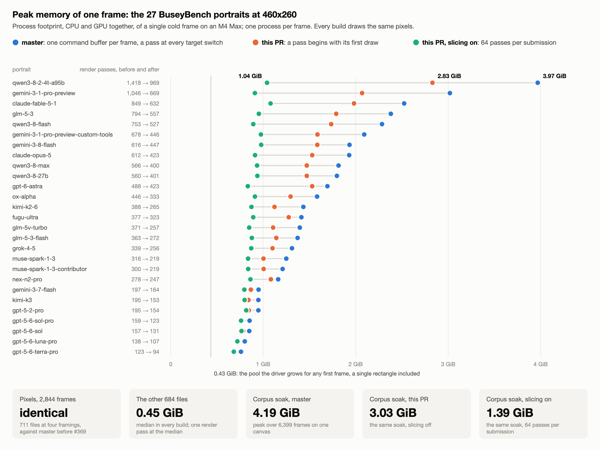

# Render-pass memory over the whole corpus (2026-10-02, femtovg#368)

What one frame costs in memory on the WGPU backend, for every corpus file, under master
(`6a5f15a`, after the Canvas split #369) and under #368 (`6e70d31`): a render pass begun
only by its first draw, and opt-in submission slices of 64 passes. M4 Max, macOS 26,
Metal.

## Method

* **Files**: 711 - the demo-assets corpus and top-level logos (410), the SVGenius
  benchmark icons (300, github.com/ZJU-REAL/SVGenius) and the Ghostscript tiger.
* **Framings**: 460x260 at pivot zooms 1, 2 and 4, and 1920x1080 with the SVG in a 1080
  box: 2,844 frames.
* **Harness**: `_logos_full.rs` built with every cfg (`harness_clip`, `harness_turbulence`,
  `harness_blend`, `harness_mix_blend`, and `harness_slices` on the #368 tree), run with
  `SKIP_UNSUPPORTED_FILTERS=1 VIEWPORT_CLIP=1`. `LAYER_STATS=1` prints the cfgs: a plain
  `cargo build` leaves all of them out.
* **Memory**: `MEM_PEAKS=1` samples the task's ledgers (`task_info(TASK_VM_INFO)`) a few
  times per millisecond and reports the frame's peak footprint (CPU and GPU together, what
  jetsam counts), the part of it tagged graphics, and the rest. One process per frame,
  run one at a time. The sampled peak matches `time -l`'s within 0.1 %.
* **Pixels**: SHA-1 of each frame; the #368 frames are also compared against Chromium 131
  (all framings) and Firefox (1x).
* **Soak**: the harness's `soak` mode, every file at three zooms for three passes on one
  canvas that is never recreated.

`corpus_run/` holds the scripts: `files.py` (the list), `refs.py` (browser references),
`run.py pixels|memory`, `soak.py`, `analyze.py`, `chart.py`. Every frame's passes, peaks
and accuracy are in `submission-slices-corpus-2026-10-02.csv`; the wait column is filled
for the 247 frames of more than 16 passes, the rest being a single slice.

## Findings

**Pixels.** All 2,844 frames are bit-identical between master before #369 (`f57a2c3`),
master, and #368 with slicing on and off. Against Chromium the frames read 0.06 % of
pixels beyond 20/255 at the median, 0.000 % structural; at 1x 0.11 % against Chromium and
0.14 % against Firefox, the two browsers 0.002 % apart.

**Passes.** A frame's driver memory is its render passes: 2.30 MiB each at the median over
122 frames of more than 100 passes, whatever the target size. On master 28 to 34 % of
them drew nothing:

| render passes per frame | master median / max | #368 median / max | fewer in total |
|---|---|---|---|
| 27 BuseyBench portraits (108 frames) | 390 / 1,453 | 312 / 991 | 28 % |
| the other 684 files (2,736 frames) | 2 / 370 | 1 / 245 | 34 % |

Outside BuseyBench 23 frames exceed 64 passes on master and 14 after the change, all 14
blur reftests and probes at 2x, 4x and 1080p; the one logo among the 23,
`google-workspace-48px` at 4x, drops from 86 passes to 58.

**Peak memory of one frame**, process footprint in MiB, median / max. About 445 MiB of
every figure is a pool the Metal driver grows for the first frame of any process, a single
rectangle included; it is purgeable once the frame completes.

| | master | #368 | #368, slicing on | slicing + wait (removed) |
|---|---|---|---|---|
| BuseyBench, 460x260 1x | 1,447 / 4,063 | 1,169 / 2,898 | 895 / 1,106 | 881 / 929 |
| BuseyBench, 460x260 2x | 1,454 / 4,110 | 1,178 / 2,936 | 900 / 1,105 | 887 / 937 |
| BuseyBench, 460x260 4x | 1,502 / 4,198 | 1,249 / 2,999 | 901 / 1,152 | 881 / 948 |
| BuseyBench, 1920x1080 | 1,727 / 4,192 | 1,433 / 3,061 | 1,044 / 1,453 | 985 / 1,063 |
| other 684 files, 460x260 1x | 460 / 772 | 458 / 663 | 458 / 661 | |
| other 684 files, 460x260 2x | 460 / 1,428 | 458 / 1,103 | 458 / 964 | |
| other 684 files, 1920x1080 | 473 / 920 | 470 / 770 | 470 / 766 | |

The CPU side of the same peaks (footprint less graphics), BuseyBench at 1x: 141 / 431 MiB
on master, 106 / 305 on #368, 66 / 92 sliced; the other files 15 / 54 on master.

Unsliced peaks repeat within 0.1 % (three runs of 54 frames). Sliced peaks depend on how
far the encoder runs ahead of the GPU: 2 % spread at the median, 18 % at worst. Slices
hold between a quarter and all of the unsliced driver memory, 60 % at the median, so they
lower the peak without bounding it. The last column is a build with the opt-in wait that
was removed from #368 (`4353a15`, at most three slices unfinished): what a bound would
give, at the price of polling the device from inside the flush.

**Soak**, 711 files on one canvas, three passes:

| | master | #368 | #368, slicing on |
|---|---|---|---|
| 460x260 x 3 zooms (6,399 frames): peak footprint | 4,288 MiB | 3,103 MiB | 1,425 MiB |
| wall time | 17.0 s | 13.8 s | 11.2 s |
| frame p50 / p99 / max, ms | 0.50 / 48.9 / 200 | 0.47 / 32.9 / 161 | 0.47 / 23.2 / 52 |
| 1920x1080 (2,133 frames): peak footprint | 4,448 MiB | 3,552 MiB | 1,621 MiB |
| wall time | 8.4 s | 7.3 s | 6.1 s |
| frame p50 / p99 / max, ms | 1.26 / 63.7 / 203 | 1.24 / 47.6 / 158 | 1.25 / 32.3 / 58 |

The driver returns its pool one to two seconds after the last heavy frame. Over ten passes
the sliced peak stays between 1,389 and 1,495 MiB after the third; over twenty passes of
the 684 non-BuseyBench files (41,040 frames) master's footprint floor moves from 856 to
876 MiB and its peak from 1,512 to 1,529.

**Quality given up for memory.** The transient budget passes layers through on 36 frames,
the same ones in every build: BuseyBench at 2x (3), 4x (24) and 1080p (6), and three
shadow-edge probes at 4x. No other file loses a layer at any framing.

## Where the undrawn passes came from

`corpus_run/pass_report.patch` (an experiment on #368, not for merging) classifies every
target switch of a frame that was left before anything was drawn, by what set the target
and what came next, and estimates the fewest passes a scheduler could use.

| undrawn passes on master | BuseyBench (108 frames) | everything else (2,736 frames) |
|---|---|---|
| all passes | 52,068 | 20,036 |
| undrawn | 14,403 (28 %) | 6,813 (34 %) |
| a filter handed the target back, the next command was another filter | 10,496 | 1,641 |
| the canvas switched target, the next command was a filter | 3,216 | 604 |
| a filter handed the target back, the next command switched it | 327 | 495 |
| the canvas switched target twice in a row | 256 | 1,336 |
| the frame's first pass: the renderer sets the screen, so does the first command | 108 | 2,736 |

Two habits of a GL-shaped command stream account for all of it. The render target is
state: `Canvas::end_layer` switches back to the parent before it runs the layer's
filters, and every filter command switches to its own targets and then restores the one
before it, as one restores a bound framebuffer. In OpenGL a bind that nothing draws
under costs nothing; the WGPU backend turned every such state change into "end the
pass, begin a pass", because a wgpu pass is the only way to have a current target.

What is left after #368 is passes that draw: 37,665 on the BuseyBench frames, 19,211
runs of canvas draws on one target and 18,454 filter passes. Merging runs on the same
target wherever no dependency sits between them (layer contents first, then one pass
on the parent) would reach 34,557 (8 % fewer) with stores reused as they are today, and
28,237 (25 %) if every cleared store were a fresh image, for 16 MiB more textures per
frame at the median and 35 MiB at most at 460x260.

## With gfx-rs/wgpu#10506

The wgpu pull request that encodes an encoder's passes into one Metal command buffer,
head `aedebc002`, against the trunk commit it is merged with (`dd033bfb7`); femtovg
built against each checkout through `[patch.crates-io]`.

| | master on wgpu trunk | master on the wgpu PR | #368 on the wgpu PR, slicing on |
|---|---|---|---|
| frames identical to wgpu 30.0.1 | 2,844 of 2,844 | 2,844 of 2,844 | 2,844 of 2,844 |
| BuseyBench 460x260, peak footprint MiB, median / max | 1,447 / 4,062 | 481 / 522 | 493 / 519 |
| BuseyBench 1920x1080 | 1,728 / 4,192 | 599 / 660 | 600 / 706 |
| other 684 files, 460x260 | 460 / 772 | 458 / 475 | 457 / 474 |
| BuseyBench 460x260, frame ms, median / max | 125 / 386 | 51 / 112 | 39 / 63 |
| soak, 460x260 x 3 zooms: peak footprint | 4,297 MiB | 604 MiB | 604 MiB |
| soak wall time; frame p99 / max, ms | 18.6 s; 53.6 / 230 | 14.8 s; 37.3 / 86 | 11.9 s; 22.3 / 49 |

Every pass of every corpus frame coalesces: what a pass costs over the driver's pool
falls from 2.30 MiB to 72 KiB at the median. femtovg's library and integration tests
(431) pass against the branch. Slicing no longer changes the memory there. Drawing no
undrawn passes still shortens the heaviest frame by a tenth (110 to 97 ms unsliced), and
slicing shortens it further because the GPU starts sooner.

